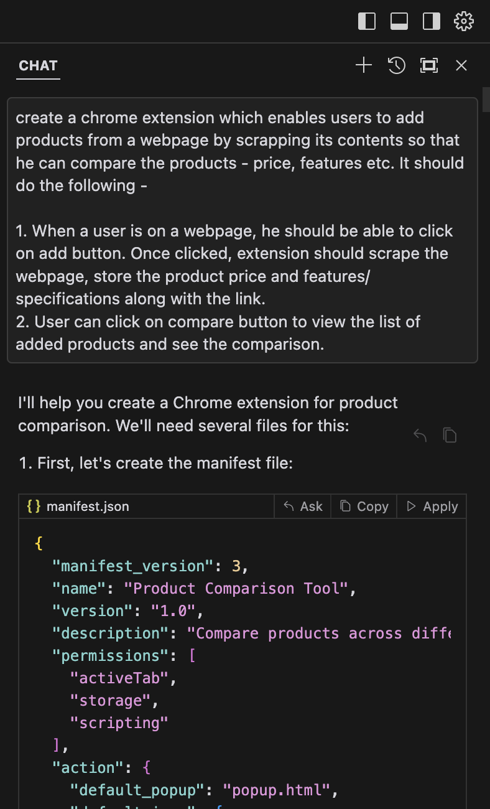
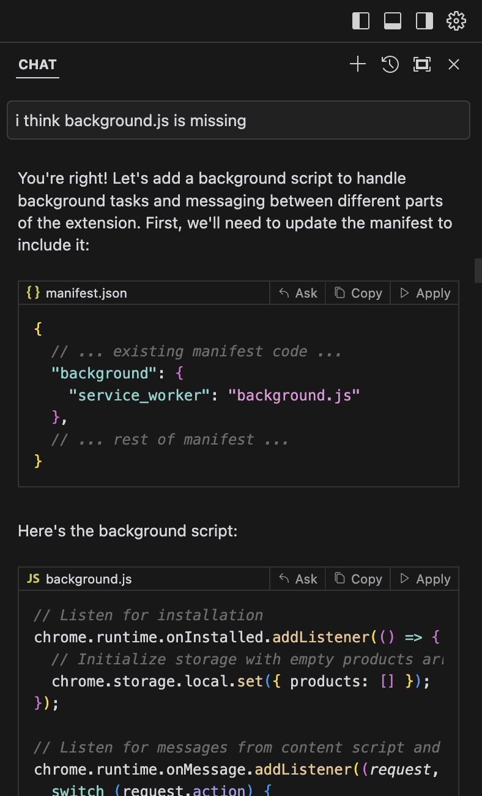
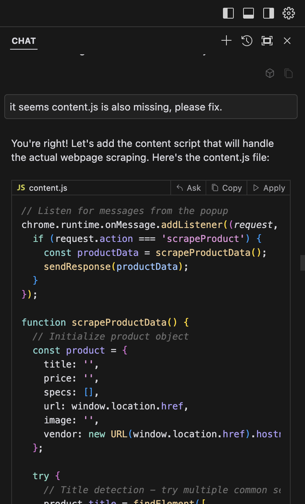
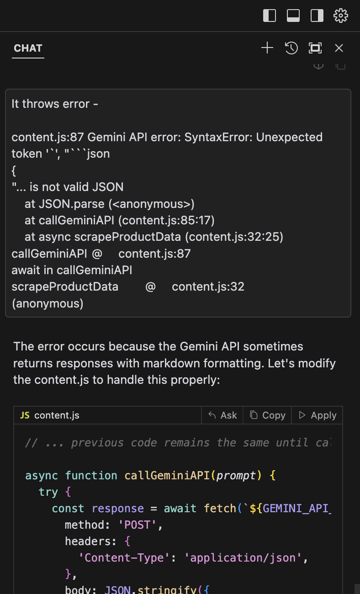
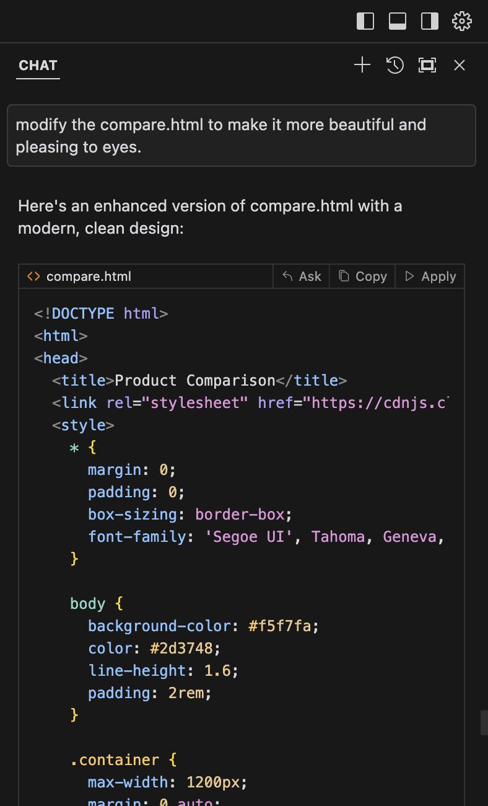

# Chrome Extension for Adding and Compare Products

This is a chrome extension that allows you to add and compare products from different websites.

## Features

- Keep adding a product to the extension storage while you search for the right product
- Compare the shorlisted products by clicking on the extension icon and compare button

## Installation

1. Clone the repository
2. Get your Gemini API key from [here](https://console.cloud.google.com/ai/apikeys)
3. Open Chrome and go to chrome://extensions/
4. Enable "Developer mode"
5. Click "Load unpacked" and select the cloned repository

# Iteration - 1

# Iteration - 2

# Iteration - 3

# Iteration - 4

# Iteration - 5

# Iteration - 6

